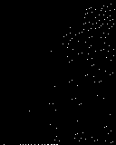
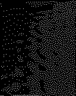
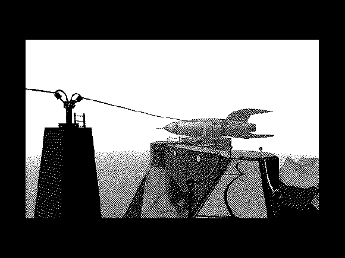
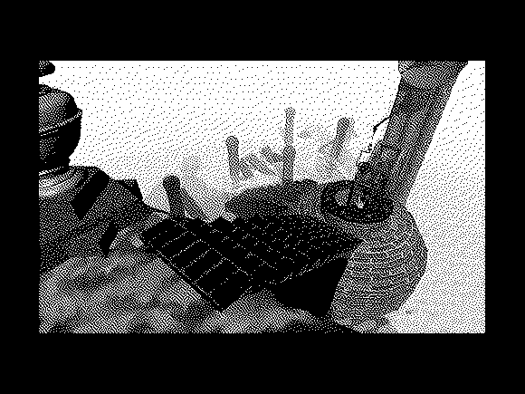
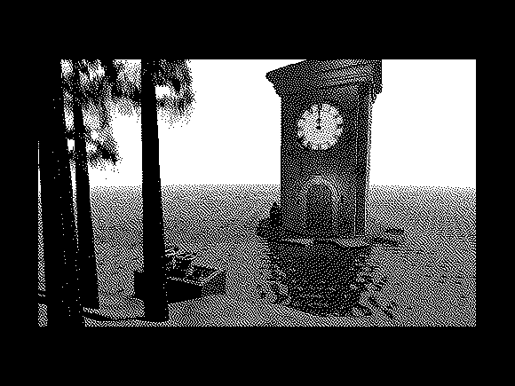

# Myst Experiments

This repository is a collection of ideas and experiments for a 2-bit port of Myst (perhaps to the Playdate). Right now it's a collection of scripts for extracting and converting the original assets to see how they work in 2-bit.

## Examples

It's not yet clear which dithering algorithm would work best–Atkinson looks great and has a real retro-Mac feel, but Floyd-Steinberg definitely captures more detail.

### Movies

Atkinson:

Floyd-Steinberg:

<table>
  <tr>
    <td>
      
      Atkinson
    </td>
    <td>
      
      Floyd-Steinberg
    </td>
  </tr>
  <tr>
    <td>
      
      Atkinson
    </td>
    <td>
      
      Floyd-Steinberg
    </td>
  </tr>
</table>

### Frames

